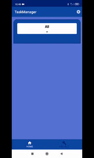
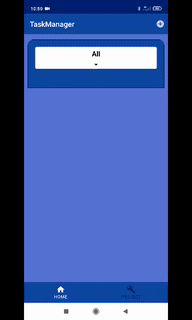
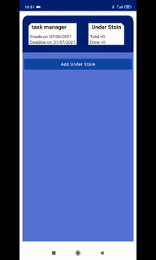
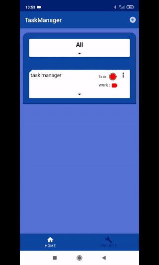
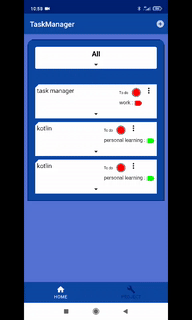
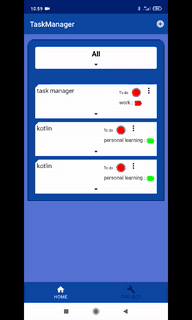

 ## 1. Requierements.

+ **Compile Sdk Version :** 30.
+ **Min Sdk Version :** 23.
+ **JavaVersion :** 1_8.
+ **KotlinVersion :** 1.4.32.
+ **ComposeVersion :** 1.0.0-beta07.

## 2. Preview.
  

   ## Preview, principal fonctionalities :
  + Manage your real estate for sale.
  + Add new property.
  + Add media from gallery, or your device's camera.
  + Update property or set them sold.
  + Show properties on maps.
  + Filter property on multi criteria values.

### Add new category.

### Add new project.

### Add new task.

### Add new under stain.

### Transform project in task.

### Filter.

### Manage all.

  

## 3. Work done :

### Clean architecture.
+ Single activity.
+ Multi module.
+ DI with Hilt.
+ Coroutines and Flow.

### Compose.
+ Entire Ui with jetpack compose.
+ Only one activity, no fragment and no business logic in application module

### Other.
+ SOLID/DRY approach.
